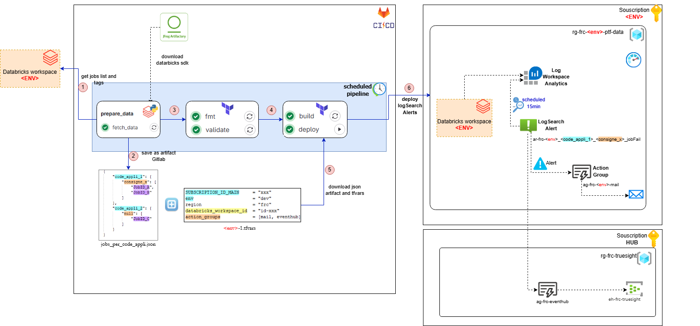
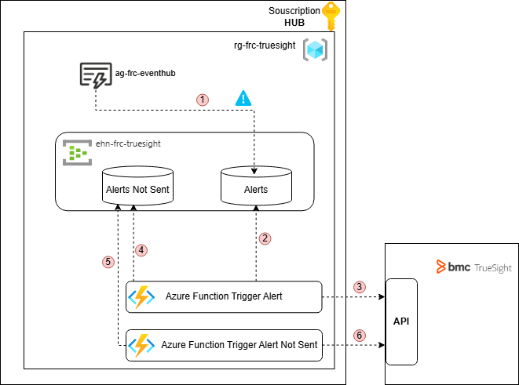
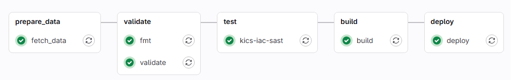

# Monitoring Databricks Jobs with Azure Monitor

This project is designed to monitor Databricks jobs using Azure Monitor. It sets up scheduled query rules to alert on job failures, with alerts configured to trigger action groups and create tickets with custom properties.

## Overview

The project consists of Terraform configurations and a CI/CD pipeline that:
1. Fetches Databricks jobs.
2. Generates a JSON file containing job IDs and consignes.
3. Converts the JSON file to Terraform variables.
4. Applies Terraform configurations to set up Azure Monitor alerts.

## Architecture



Once the alerts are sent to the Azure Eventhub dedicated to ITSM monitoring, an existing mechanism in the Azure foundation allows these alerts to be consumed by TrueSight.
This mechanism is described in this diagram: 

### Diagram Steps

1. The action group automatically deposits alerts into the Event Hub queue.
2. The Event Hub transmits the alerts to an Azure Function.
3. The Azure Function processes the alerts and sends them to TrueSight.
4. In case of unavailability, the function attempts to re-send the event to TrueSight for 5 minutes.
   If it fails, the function deposits the event into the Event Hub's unsent alerts queue.
5. A second function is subscribed to the Event Hub's unsent alerts queue:
6. This function sends the alert to the BMC TrueSight APIs. In case of unavailability, the function attempts to re-send the event to TrueSight.
   If it fails, the function re-deposits the event into the Event Hub's unsent alerts queue.

## Prerequisites

- Azure subscription
- A Databricks Workspace
- Terraform installed locally
- GitLab CI/CD configured

## Configuration

### Environment Variables

Add the following environment variables in **GitLab → Settings → CI/CD → Variables**:
- `DATABRICKS_CLIENT_ID`: The client ID of the Databricks application.
- `DATABRICKS_CLIENT_SECRET`: The client secret of the Databricks application.
- `DATABRICKS_TENANT_ID`: The tenant ID of the Azure application for Databricks.
- `DATABRICKS_WORKSPACE_URL`: The URL of the Databricks workspace.
- `ARM_CLIENT_ID`: The client ID of the Azure Resource Manager application.
- `ARM_CLIENT_SECRET`: The client secret of the Azure Resource Manager application.
- `ARM_TENANT_ID`: The tenant ID of the Azure application for Azure Resource Manager.

### Terraform Variables

Define the following variables in your Terraform configuration files:

- [`variables.tf`](./infrastructure/variables.tf)
- [`dev-1.tfvars`](./infrastructure/environments/dev.tfvars)

#### Example: `dev.tfvars`

The `dev.tfvars` file should contain the following variables:

- `SUBSCRIPTION_ID_MAIN`: The subscription ID for the main deployment.
- `zone`: The zone for the resource.
- `env`: The environment for the resource (e.g., dev, rec, prd).
- `location`: The Azure location for the resource.
- `location_code`: The location code for the resource.
- `code_appli_socle`: The code of the application socle.
- `databricks_workspace_id`: The ID of the Databricks workspace.
- `action_groups`: A list of action groups to trigger.
- `severity`: The severity level of the alert.
- `window_duration`: The window duration for the alert.
- `evaluation_frequency`: The evaluation frequency for the alert.
- `auto_mitigation_enabled`: Whether auto mitigation is enabled for the alert.
- `tags`: A map of tags to apply to the resources.

## CI/CD Pipeline

The GitLab CI/CD pipeline is defined in `.gitlab-ci.yml` and consists of the following stages:

1. **prepare_data**: Fetches Databricks jobs and generates a JSON file.
    - The schema of this JSON is as follows: [`jobs_per_code_appli.template`](./docs/jobs_per_code_appli.template)
    - An example JSON file is as follows:
        ```json
        {
            "xx1": {
                "KB10213": [
                    1118335725061527,
                    187947243162082
                ],
                "KB13487": [
                    23802618648050
                ]
            },
            "yy1": {
                "KB15423": [
                    1087035640099944
                ],
                "null": [
                    97839987307358
                ]
            }
        }
        ```
2. **validate**: Validates the Terraform configuration.
3. **test**: Runs tests on the Terraform configuration.
4. **build**: Builds the Terraform configuration.
5. **deploy**: Deploys the Terraform configuration.

### Pipeline Diagram



### Pipeline Configuration

The pipeline configuration is defined in the following file:

- [`.gitlab-ci.yml`](./.gitlab-ci.yml)

## Running the Pipeline

1. **Commit and push your changes**: This will trigger the GitLab CI/CD pipeline.
2. **Monitor the pipeline**: Check the pipeline status in GitLab to ensure all stages complete successfully.
3. **Verify the deployment**: Ensure that the Azure Monitor alerts are created and configured correctly.

## Troubleshooting

- **Resource already exists**: If you encounter an error stating that a resource already exists, you may need to import the resource into the Terraform state.
- **Proxy issues**: Ensure that the proxy settings are correctly configured and that the necessary domains are excluded from the proxy.

## Conclusion

This project automates the monitoring of Databricks jobs using Azure Monitor, providing a robust and scalable solution for alerting on job failures. By following the steps outlined in this README, you can set up and configure the monitoring solution in your environment.
